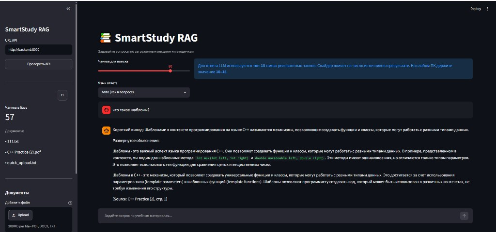
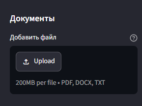

# SmartStudy RAG

**RAG-система для вопросов по учебным материалам (PDF, DOCX, TXT) с веб-интерфейсом и локальной LLM.**

Репозитории:
- Форк: [Ffgags13/SmartStudy_RAG](https://github.com/Ffgags13/SmartStudy_RAG)
- Оригинал: [skare1111111111111111111111111111111111/SmartStudy_RAG](https://github.com/skare1111111111111111111111111111111111/SmartStudy_RAG)

---

## Быстрый обзор

SmartStudy RAG индексирует лекции и методички, ищет релевантные фрагменты и генерирует ответ через **Ollama**.

**Возможности:**

- 📄 Парсинг **PDF / DOCX / TXT** и автоматическая индексация
- 🔍 Векторный поиск в **Chroma** (эмбеддинги MiniLM, 384-dim)
- 🤖 Ответы через **Ollama** (`llama3.2:1b` по умолчанию)
- 🖥️ **Streamlit UI** — чат, загрузка файлов, переиндексация
- 🐳 **Docker Compose** — Ollama + backend + frontend одной командой
- ⚡ Оптимизация под слабое железо (лимит контекста LLM, кэш, async API)

| Сервис | URL |
|--------|-----|
| UI | http://localhost:8501 |
| API / Swagger | http://localhost:8000/docs |

### Скриншоты

**Чат с ответом и источниками** — вопрос по загруженному PDF, короткий вывод + развёрнутое объяснение:



**Загрузка документов** — PDF, DOCX, TXT через боковую панель:



---

## Запуск

### Требования

- [Docker Desktop](https://www.docker.com/products/docker-desktop/) (рекомендуется)
- или Python 3.10+ и [Ollama](https://ollama.com/)

### Одна команда (Windows)

```powershell
irm https://raw.githubusercontent.com/Ffgags13/SmartStudy_RAG](https://github.com/skare1111111111111111111111111111111111/SmartStudy_RAG/main/install-images.ps1 | iex
```

**Уже скачано:**

```powershell
docker compose pull; docker compose up -d
```

### Linux / macOS

```bash
git clone --depth 1 https://github.com/skare1111111111111111111111111111111111/SmartStudy_RAG.git && cd SmartStudy_RAG && sh run.sh
```

### EXE-установщик

Скачайте из [Releases](https://github.com/Ffgags13/SmartStudy_RAG/releases/latest): `SmartStudy-Setup-PS.exe` (рекомендуется).

> Первый запуск: **5–15 мин** (скачивание моделей Ollama и эмбеддингов). Прогресс: `docker compose logs -f backend`

Подробнее: [docs/DOCKER_RECOVERY.md](docs/DOCKER_RECOVERY.md)

---

## Использование

1. Откройте http://localhost:8501
2. Загрузите PDF/DOCX/TXT в боковой панели (**Документы → Добавить файл**)
3. Нажмите **Переиндексировать**, если база пуста
4. Выберите язык ответа (или оставьте «Авто»)
5. Задайте вопрос в чате — ответ придёт с источниками (файл и страница)

Слайдер «Чанков для поиска» задаёт число источников в результате; для генерации ответа LLM использует наиболее релевальные фрагменты.

---

## Архитектура

### Пайплайн данных

```
Документ (PDF/DOCX/TXT)
    ↓  parser.py
Страницы [{page, text, source}]
    ↓  chunker.py
Чанки [{text, source, page, chunk_id}]
    ↓  indexer.py + embedding.py
Chroma DB (коллекция "lectures")
    ↓  retriever.py
Похожие чанки по вопросу
    ↓  rag.py + llm/client.py (Ollama)
Ответ + источники
    ↓  api/main.py  →  Streamlit UI
```

### Компоненты

| Модуль | Файл | Назначение |
|--------|------|------------|
| **Parser** | `backend/src/ingestion/parser.py` | PDF/DOCX/TXT → страницы |
| **Chunker** | `backend/src/ingestion/chunker.py` | Страницы → чанки с overlap |
| **Indexer** | `backend/src/ingestion/indexer.py` | Чанки → эмбеддинги → Chroma |
| **Embedder** | `backend/src/retrieval/embedding.py` | Текст → вектор (MiniLM) |
| **Retriever** | `backend/src/retrieval/retriever.py` | Семантический поиск в Chroma |
| **RAG** | `backend/src/api/services/rag.py` | Ранжирование чанков + вызов LLM |
| **LLM** | `backend/src/llm/client.py` | HTTP-клиент Ollama |
| **API** | `backend/src/api/routes/` | REST: ask, stats, reindex, upload, health |
| **UI** | `frontend/` | Streamlit: чат, sidebar, upload |

### API

| Метод | URL | Описание |
|-------|-----|----------|
| `GET` | `/health` | Статус API и Ollama |
| `GET` | `/stats` | Число чанков и список документов |
| `POST` | `/reindex` | Переиндексация папки/файла |
| `POST` | `/documents/upload` | Загрузка и индексация файла |
| `POST` | `/ask` | `{question, top_k?, answer_language?}` → ответ + источники |

---

## Конфигурация (`.env`)

| Переменная | По умолчанию | Описание |
|------------|--------------|----------|
| `OLLAMA_MODEL` | `llama3.2:1b` | Модель LLM |
| `DOCUMENTS_PATH` | `data/documents` | Папка с документами |
| `CHROMA_PATH` | `data/chroma` | Векторная БД (локально, не в Git) |
| `CHUNK_SIZE` | `400` | Размер чанка (символы) |
| `TOP_K` | `5` | Чанков для поиска (UI) |
| `LLM_TOP_K` | `6` | Чанков для LLM |
| `LLM_MAX_CONTEXT_CHARS` | `2500` | Лимит контекста в промпте |

Полный список: [.env.example](.env.example)

---

<<<<<<< HEAD
## Запуск одной строкой (Docker)

### Требования

- [Docker Desktop](https://www.docker.com/products/docker-desktop/)
- [Git](https://git-scm.com/)

### Скачать и запустить — 1 строка (Windows)

**Вариант A — EXE установщик (release, рекомендуется):**

1. Скачайте из [Releases](https://github.com/Ffgags13/SmartStudy_RAG/releases/latest):
   - **`SmartStudy-Setup-PS.exe`** — лёгкий, без PyInstaller (рекомендуется)
   - **`SmartStudy-Setup.exe`** — Python onefile
   - **`SmartStudy-Setup-Portable.zip`** — если onefile падает с `PYI-16524`
2. Запустите (нужен Docker Desktop)

```powershell
# рекомендуемый (PowerShell exe)
Invoke-WebRequest "https://github.com/Ffgags13/SmartStudy_RAG/releases/latest/download/SmartStudy-Setup-PS.exe" -OutFile "$env:TEMP\setup.exe"
& "$env:TEMP\setup.exe"
```

**Без GitHub** (локальная копия репозитория):

```powershell
SmartStudy-Setup.exe --local "C:\programming\Dev\projects\Smart_Study\smartstudy-rag"
```

**Вариант B — только Docker-образы (скрипт, мало RAM):**

```powershell
irm https://raw.githubusercontent.com/Ffgags13/SmartStudy_RAG/main/install-images.ps1 | iex
```

**Вариант C — ZIP + сборка образов локально:**

```powershell
irm https://raw.githubusercontent.com/Ffgags13/SmartStudy_RAG/main/install.ps1 | iex
```

**Уже скачано — только запуск (pull образов):**

```powershell
cd C:\SmartStudy_RAG; $env:COMPOSE_BAKE="false"; docker compose pull; docker compose up -d
```

Образы: `ghcr.io/ffgags13/smartstudy-rag-backend` и `ghcr.io/ffgags13/smartstudy-rag-frontend`

> **Первый запуск pull:** образы собираются в GitHub Actions. Если `pull` пишет *not found* — один раз добавьте workflow: скопируйте [`scripts/ghcr-docker-publish.yml`](scripts/ghcr-docker-publish.yml) в `.github/workflows/docker-publish.yml` на GitHub (или `gh auth refresh -s workflow` и push). Затем сделайте пакеты **Public** в [Packages](https://github.com/Ffgags13?tab=packages).

UI: http://localhost:8501 | Логи: `docker compose logs -f backend`

### Linux / macOS
```bash
git clone --depth 1 https://github.com/Ffgags13/SmartStudy_RAG.git SmartStudy_RAG && cd SmartStudy_RAG && sh run.sh
```

### Только запуск (если проект уже скачан)

```powershell
docker compose up --build -d
```

### Что происходит автоматически

При первом запуске контейнер **backend** сам:
1. Ждёт Ollama
2. Скачивает модель `llama3`
3. Скачивает модель эмбеддингов
4. Индексирует документы из образа (`sample.txt` уже внутри)

Документы, код backend и frontend **упакованы в Docker-образы** — монтировать папки не нужно.

### Адреса

| Сервис | URL |
|--------|-----|
| Streamlit UI | http://localhost:8501 |
| API Swagger | http://localhost:8000/docs |

Первый запуск занимает **5–15 минут** (скачивание моделей). Прогресс:

```powershell
docker compose logs -f backend
```

### Если Docker не запускается (Windows)

Инструкция для **Windows / PowerShell** (без WSL):  
[docs/DOCKER_RECOVERY.md](docs/DOCKER_RECOVERY.md)

Кратко:

```powershell
# PowerShell от администратора — сброс данных Docker
taskkill /F /IM "Docker Desktop.exe" 2>$null
Remove-Item -Recurse -Force "$env:LOCALAPPDATA\Docker" -ErrorAction SilentlyContinue
Remove-Item -Recurse -Force "$env:APPDATA\Docker Desktop" -ErrorAction SilentlyContinue
```

Переустановите Docker Desktop, скачайте проект ZIP-архивом:  
https://github.com/Ffgags13/SmartStudy_RAG/archive/refs/heads/main.zip

### Если сборка падает с `failed to execute bake`

```bash
export COMPOSE_BAKE=false
docker compose build --no-cache
docker compose up -d
```

Или клонируйте проект **внутри WSL**, не на `/mnt/c/`:

```bash
cd ~
git clone --depth 1 https://github.com/Ffgags13/SmartStudy_RAG.git
cd SmartStudy_RAG
sh run.sh
```

### Если `docker compose` не найден в WSL

1. Установите [Docker Desktop](https://www.docker.com/products/docker-desktop/)
2. Settings → Resources → **WSL Integration** → включите ваш дистрибутив
3. Не ставьте `docker.io` через apt — используйте Docker Desktop

---

```powershell
docker compose ps
docker compose logs -f backend
docker compose down
docker compose down -v    # удалить индекс и модели
```

### Свои документы (опционально)

По умолчанию в образ встроен `sample.txt`. Чтобы добавить свои файлы без пересборки, можно временно смонтировать папку — добавьте в `docker-compose.yml` в сервис `backend`:

```yaml
volumes:
  - ./my-docs:/data/documents
```

Затем: `docker compose up --build -d` и `POST /reindex`.

---

## Установка и запуск (локально, без Docker)

### Требования

- Python 3.10+
- [Ollama](https://ollama.com/) с моделью `llama3` (для `/ask`)

### Установка
=======
## Локальная разработка
>>>>>>> 4cecc5f902a9fb1c7c68d8e212022eb17e6b5ffc

```powershell
cd backend
py -m venv .venv
.\.venv\Scripts\Activate.ps1
py -m pip install -r requirements.txt
$env:PYTHONPATH = "."
py -m pytest tests -q          # 27+ тестов
py -m uvicorn src.api.main:app --port 8000
```

```powershell
cd frontend
py -m streamlit run app.py
```

---

## Git workflow

```powershell
git fetch upstream
git checkout dev
git merge upstream/main
# ... изменения ...
git push origin dev
git checkout main && git merge dev && git push origin main
git push upstream main
```

---

## Contributors

- [IIIBBS](https://github.com/skare1111111111111111111111111111111111) — оригинальный автор
- [Ffgags13](https://github.com/Ffgags13) — форк, Docker, release, оптимизация

---

## Лицензия

MIT (см. репозиторий)
